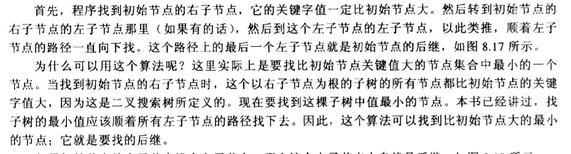
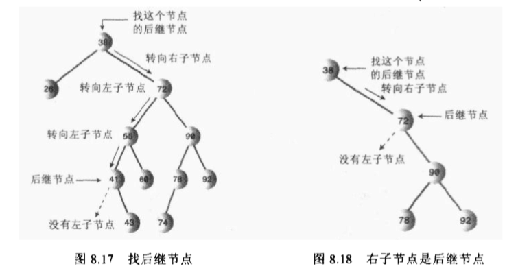
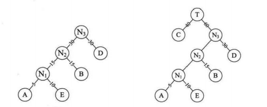
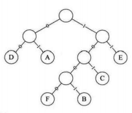

## 树

树是一个很有意思的数据结构，而且有很多种不同的树结构，比如BST，哈夫曼树，红黑树，AVL树，2-3-4树，B树等。它们的定义和功能优势各不相同，所以在这里进行一个简单的总结区分。

### BST(二叉搜索树)

BST的一个特点是一个节点的关键值都大于它的左子孙节点的关键值，小于等于它的右子孙节点的关键值。树在执行查找，插入，删除的时间复杂度都为O(logN)。

在BST中查找，插入都比较容易实现，但是删除的话需要考虑的情况就比较复杂，包括删除节点有无子节点，有一个子节点，有两个子节点等情况。如果节点有两个节点的话，再删除时应该寻找后继节点代替它并适当调整树的结构，使其满足BST的定义。

下面两幅图就介绍了如何寻找后继节点，在实例程序中使用getSuccessor()方法实现。






实例程序中仅包含了基本的查找，插入，删除方法。还增加了树的遍历方法，包括前序，中序，后序遍历，不过实现思路基本类似，也并不难理解。

```java
package datastructure;

import java.util.Stack;

public class TreeApp {

    public static void main(String[] args) {

        Tree theTree = new Tree();

        theTree.insert(13, 11);
        theTree.insert(1, 2.3);
        theTree.insert(4,5.7);
        theTree.insert(21, 2.3);
        theTree.insert(41,5.7);
        theTree.insert(3, 11);

        System.out.println("展示：");
        theTree.displayTree();

        System.out.println("查找：");
        int value = 21;
        Node found = theTree.find(value);
        if(found != null){
            System.out.print("Found: ");
            found.displayNode();
            System.out.println();
        }
        else
            System.out.println("No Found");


        System.out.println("遍历：(1:前序，2：中序，3：中序)");
        theTree.traverse(1);
        theTree.traverse(2);
        theTree.traverse(3);


        System.out.println("删除：");
        boolean delete = theTree.delete(value);
        if(delete){
            System.out.println("Delete: "  + value);
        }
        else
            System.out.println("Can't delete");


        System.out.println("展示：");
        theTree.displayTree();

    }
}


class Node{

    public int iData;    // 树节点的数据结构
    public double dData;

    public Node leftChild;
    public Node rightChild;


    public void displayNode(){

        System.out.println("{" + iData + "," + dData + "}");
    }
}

class Tree{
    public Node root;

    public Tree(){
        root = null;
    }


    public Node find(int key){
        Node current  = root;

        while(current.iData != key){

            if(key < current.iData){
                current = current.leftChild;
            }
            else
                current =current.rightChild;

            if(current == null){
                return null;
            }
        }
        return current;
    }


    public void insert(int id, double dd){

        Node newNode = new Node();
        newNode.iData = id;
        newNode.dData = dd;

        if(root == null){
            root = newNode;
        }
        else{
            Node current = root;
            Node parent;

            while(true){

                parent = current;  // 先将当前节点保存为父亲节点

                if(id < current.iData){
                    current = current.leftChild;

                    if(current == null){
                        parent.leftChild = newNode;
                        return;
                    }
                }
                else {
                    current = current.rightChild;

                    if (current == null){
                        parent.rightChild = newNode;
                        return;
                    }
                }
            }
        }
    }


    // 删除节点，考虑的情况比较多

    public boolean delete(int key){

        Node current = root;
        Node parent = root;

        boolean isLeftChild = true;

        // 寻找节点
        while(current.iData != key){
            parent = current;

            if(key < current.iData){
                isLeftChild = true;
                current = current.leftChild;
            }
            else{
                isLeftChild = false;
                current = current.rightChild;
            }

            if (current == null){
                return false;
            }
        }


        // 没有子节点(是root？isLeftChild？)
        if(current.leftChild == null && current.rightChild == null){
            if(current == root){
                root = null;
            }
            else if(isLeftChild){
                parent.leftChild = null;
            }
            else {
                parent.rightChild = null;
            }
        }
        else if(current.rightChild == null){
            // 没有右子节点
            if(current == root){
                root = current.leftChild;
            }
            else if(isLeftChild){
                parent.leftChild = current.leftChild;
            }
            else
                parent.rightChild = current.leftChild;
        }
        else if(current.leftChild == null){
            // 没有左子节点
            if (current == root){
                root = current.rightChild;
            }
            else if(isLeftChild){
                parent.leftChild = current.rightChild;
            }
            else
                parent.rightChild = current.rightChild;
        }

        else{
            // 既有左子节点，又有右子节点
            // 中序后继代替，找出后继节点
            Node successor = getSuccessor(current);

            if(current == root){
                root = current;
            }
            else if(isLeftChild){
                current.leftChild = successor;
            }
            else
                current.rightChild =successor;

            // 把当前节点的左子节点，设置为后继节点的左子节点
            successor.leftChild = current.leftChild;
        }

        return true;
    }


    private Node getSuccessor(Node delNode) {
        Node successorParent = delNode;
        Node successor = delNode;
        Node current = delNode.rightChild; // 查找删除节点的右子树

        while (current != null){
            successorParent = successor; // 保存后继节点

            successor = current;
            current = current.leftChild; // 找左子节点
        }

        if(successor != delNode.rightChild){
            // 后继节点为左子节点
            successorParent.leftChild = successor.rightChild;
            successor.rightChild = delNode.rightChild;

        }
        return successor; // 返回后继节点
    }

    // 树的遍历(前序，中序，后序)
    public void traverse(int traverseType){
        switch (traverseType){
            case 1:
                System.out.println("前序遍历：");
                preOrder(root);
                break;

            case 2:
                System.out.println("中序遍历：");
                inOrder(root);
                break;

            case 3:
                System.out.println("后序遍历：");
                postOrder(root);
                break;
        }
        System.out.println();
    }

    // 前序遍历
    // 1.访问节点，2.调用自身遍历该节点的左子树，3.调用自身遍历该节点的右子树
    private void preOrder(Node localRoot) {
        if (localRoot != null){

            System.out.print(localRoot.iData + " ");
            preOrder(localRoot.leftChild);
            preOrder(localRoot.rightChild);
        }

    }

    private void inOrder(Node localRoot) {

        if (localRoot != null){

            preOrder(localRoot.leftChild);
            System.out.print(localRoot.iData + " ");
            preOrder(localRoot.rightChild);
        }

    }

    private void postOrder(Node localRoot) {
        if (localRoot != null){

            preOrder(localRoot.leftChild);
            preOrder(localRoot.rightChild);
            System.out.print(localRoot.iData + " ");
        }
    }


    public void displayTree(){


        java.util.Stack globalStack = new Stack();
        globalStack.push(root);

        int nBlanks = 32;
        boolean isRowEmpty = false;
        System.out.println(".............................................");
        while (isRowEmpty == false){

            java.util.Stack localStack = new Stack();
            isRowEmpty = true;

            for (int i = 0; i < nBlanks ; i++) {
                System.out.print(' ');
            }

            while (globalStack.isEmpty() == false){
                Node temp = (Node)globalStack.pop();

                if(temp != null){
                    System.out.print(temp.iData);
                    localStack.push(temp.leftChild);
                    localStack.push(temp.rightChild);

                    if(temp.leftChild != null || temp.rightChild != null){
                        isRowEmpty = false;
                    }
                }
                else{
                    System.out.print("--");
                    localStack.push(null);
                    localStack.push(null);
                }

                for (int j = 0; j < nBlanks * 2 - 2; j++ ){
                    System.out.print(' ');
                }
            }
            System.out.println();

            nBlanks /= 2;

            while (localStack.isEmpty() == false){
                globalStack.push(localStack.pop());
            }
        }

        System.out.println(".............................................");
    }
}

```


### 哈夫曼树

哈夫曼树是带权路径长度最短的树，权值较大的结点离根较近。哈夫曼树是二叉树但不是BST，常用于数据压缩算法，称为哈夫曼编码，出现频率大的字符编码位数少，出现频率小的字符编码位数多一些。

构造：将权值从小到大排序，后将权值最小的两个并在一起成新的二叉树。




举个例子：利用构造哈夫曼树进行哈夫曼编码，实现数据压缩。假设假设各个字母频率为A 27,B 8,C 15,D 15,E 30,F 5，按照字母频次进行编码压缩后，数据的存储位会减少许多。

| 字母       | A    | B    | C    | D    | E    | F    |
| ---------- | ---- | ---- | ---- | ---- | ---- | ---- |
| 二进制字符 | 01   | 1001 | 101  | 00   | 11   | 1000 |





