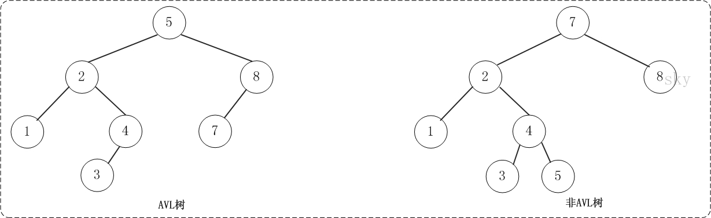

### 红黑树

红黑树是一个重要而常用的平衡二叉树，解决了BST插入导致的不平衡问题，而且效率也比较高，它究竟利用什么机制来维持平衡呢？

红黑树-规则（保证一棵树平衡）

1. 每个节点不是红色就是黑色
2. 根总是黑色
3. 如果节点是红色的，则它的子节点必须是黑的
4.  从根到叶子节点或是空子节点的路径中，必须有相同数目的黑色节点。

修正违规情况：

1. 改变节点颜色

2. 执行旋转操作

红黑树的为了维持平衡，当插入数据不满足红黑树规则时，需要通过改变节点颜色，或者是旋转操作，这些操作通常的互相影响的，有一种牵一发而动全身的感觉，所以代码实现起来也是相对困难的，这里大致了解一个原理即可。

红黑树的应用比较广泛，主要是用它来存储有序的数据，它的时间复杂度是O(lgn)，效率非常之高。例如，Java集合中的TreeSet和TreeMap，C++ STL中的set、map，以及Linux虚拟内存的管理，都是通过红黑树去实现的。

### AVL树

平衡二叉树，本质上是二叉搜索树，但带有平衡条件，即它是一棵空树或它的左右两个子树的高度差的绝对值不超过1，并且左右两个子树都是一棵平衡二叉树。

优点：由于插入方式不同导致树的高度也有所不同，可能会导致二叉树的高度是O(N)，而AVL树就不会出现这种情况，树的高度始终是O(logN).