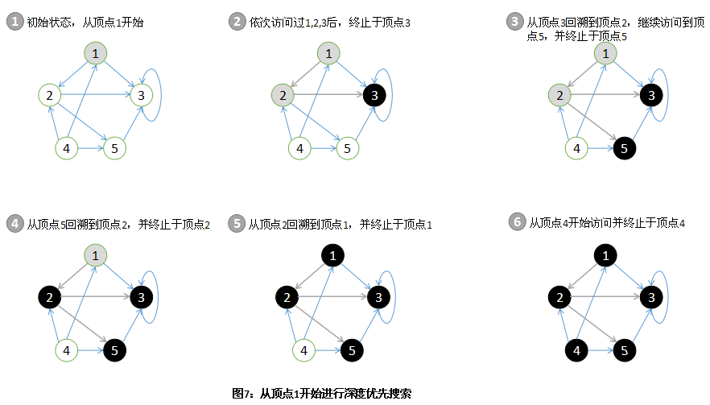
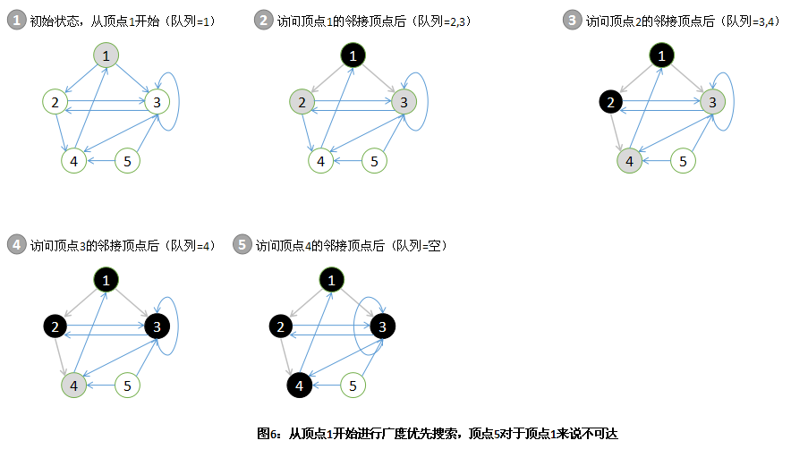

### DFS( 深度优先搜索)

深度优先搜索在搜索过程中每当访问到某一个顶点后，需要递归地访问此顶点的所有未访问过的相邻顶点。因而，这种搜索将尽可能深地持续探索，直到无法继续为止。DFS是通过栈来实现的。

该算法执行过程是：从图中某个顶点发 v 出发，访问此顶点，然后依次从 v 的未被访问的邻接点出发深度优先遍历图，直至图中所有和 v 有路径相通的顶点都被访问到；若此时图中尚有顶点未被访问，则另选图中一个未曾被访问的顶点作起始点，重复上述过程，直至图中所有顶点都被访问到为止。




### BFS( 广度优先搜索)

广度优先搜索在进一步探索图中的顶点之前，先访问当前顶点的所有邻接顶点。BFS是通过队列实现的。

该算法执行过程是：对于队列中的每一个顶点（初始状态下只有起始顶点），从队列首部选出这个顶点并找出每一个与之相邻接的顶点，将找到的邻接顶点入队到队列的末尾。




使用Java实现的DFS和BFS：

```java
package datastructure;

import java.util.ArrayList;
import java.util.LinkedList;

public class GraphApp {

    public static void main(String args[]) {

        int n = 8, e = 9;// 分别代表结点个数和边的数目
        String labels[] = { "1", "2", "3", "4", "5", "6", "7", "8" };// 结点的标识
        Graph graph = new Graph(n);
        for (String label : labels) {
            graph.insertVertex(label);// 插入结点
        }
        // 插入九条边
        graph.insertEdge(0, 1, 1);
        graph.insertEdge(0, 2, 1);
        graph.insertEdge(1, 3, 1);
        graph.insertEdge(1, 4, 1);
        graph.insertEdge(3, 7, 1);
        graph.insertEdge(4, 7, 1);
        graph.insertEdge(2, 5, 1);
        graph.insertEdge(2, 6, 1);
        graph.insertEdge(5, 6, 1);
        graph.insertEdge(1, 0, 1);
        graph.insertEdge(2, 0, 1);
        graph.insertEdge(3, 1, 1);
        graph.insertEdge(4, 1, 1);
        graph.insertEdge(7, 3, 1);
        graph.insertEdge(7, 4, 1);
        graph.insertEdge(6, 2, 1);
        graph.insertEdge(5, 2, 1);
        graph.insertEdge(6, 5, 1);

        System.out.println("深度优先搜索序列为：");
        graph.depthFirstSearch();
        System.out.println();
        System.out.println("广度优先搜索序列为：");
        graph.broadFirstSearch();
    }
}

class Graph {
    private ArrayList vertexList; // 存储顶点的链表
    private int[][] edges;        // 邻接矩阵，用来存储边
    private int numOfEdges;       // 边的数目
    boolean[] isVisited;

    public Graph(int n) {
        // 初始化矩阵，一维数组，和边的数目
        edges = new int[n][n];
        vertexList = new ArrayList(n);
        numOfEdges = 0;
    }

    // 得到结点的个数
    public int getNumOfVertex() {
        return vertexList.size();
    }

    // 得到边的数目
    public int getNumOfEdges() {
        return numOfEdges;
    }

    // 返回结点i的数据
    public Object getValueByIndex(int i) {
        return vertexList.get(i);
    }

    // 返回v1,v2的权值
    public int getWeight(int v1, int v2) {
        return edges[v1][v2];
    }

    // 插入结点
    public void insertVertex(Object vertex) {
        vertexList.add(vertexList.size(), vertex);
    }

    // 插入结点
    public void insertEdge(int v1, int v2, int weight) {
        edges[v1][v2] = weight;
        numOfEdges++;
    }

    // 删除结点
    public void deleteEdge(int v1, int v2) {
        edges[v1][v2] = 0;
        numOfEdges--;
    }

    // 得到第一个邻接结点的下标
    public int getFirstNeighbor(int index) {
        for (int j = 0; j < vertexList.size(); j++) {
            if (edges[index][j] > 0) {
                return j;
            }
        }
        return -1;
    }

    // 根据前一个邻接结点的下标来取得下一个邻接结点
    public int getNextNeighbor(int v1, int v2) {
        for (int j = v2 + 1; j < vertexList.size(); j++) {
            if (edges[v1][j] > 0) {
                return j;
            }
        }
        return -1;
    }

    // 私有函数，深度优先遍历
    private void depthFirstSearch(boolean[] isVisited, int i) {
        // 首先访问该结点，在控制台打印出来
        System.out.print(getValueByIndex(i) + "  ");
        // 置该结点为已访问
        isVisited[i] = true;

        int w = getFirstNeighbor(i);
        while (w != -1) {
            if (!isVisited[w]) {
                depthFirstSearch(isVisited, w);
            }
            w = getNextNeighbor(i, w);
        }
    }

    // 对外公开函数，深度优先遍历，与其同名私有函数属于方法重载
    public void depthFirstSearch() {
        isVisited = new boolean[vertexList.size()];
        for (int i = 0; i < getNumOfVertex(); i++) {
            // 因为对于非连通图来说，并不是通过一个结点就一定可以遍历所有结点的。
            if (!isVisited[i]) {
                depthFirstSearch(isVisited, i);
            }
        }
    }

    // 私有函数，广度优先遍历
    private void broadFirstSearch(boolean[] isVisited, int i) {
        int u, w;
        LinkedList queue = new LinkedList();

        // 访问结点i
        System.out.print(getValueByIndex(i) + "  ");
        isVisited[i] = true;
        // 结点入队列
        queue.addLast(i);
        while (!queue.isEmpty()) {
            u = ((Integer) queue.removeFirst()).intValue();
            w = getFirstNeighbor(u);
            while (w != -1) {
                if (!isVisited[w]) {
                    // 访问该结点
                    System.out.print(getValueByIndex(w) + "  ");
                    // 标记已被访问
                    isVisited[w] = true;
                    // 入队列
                    queue.addLast(w);
                }
                // 寻找下一个邻接结点
                w = getNextNeighbor(u, w);
            }
        }
    }

    // 对外公开函数，广度优先遍历
    public void broadFirstSearch() {
        isVisited = new boolean[vertexList.size()];
        for (int i = 0; i < getNumOfVertex(); i++) {
            if (!isVisited[i]) {
                broadFirstSearch(isVisited, i);
            }
        }
    }
}

```

