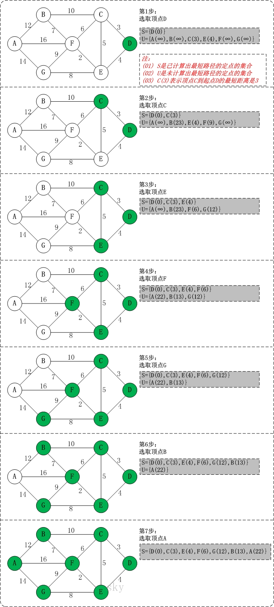

### 最短路径

对于网图来说，最短路径是指两顶点之间经过的边上权值之和最少的路径，并且称路径上的第一个顶点是源点，最后一个顶点是终点；

最短路经算法现在重要的应用有计算机网络路由算法，机器人探路，交通路线导航，人工智能，游戏设计等等。

**Dijkstra算法 ** 

Dijkstra 算法是典型的单源最短路径算法，用于计算一个结点到其他所有结点的最短路径。主要特点是以起始点为中心向外层层扩展，直到扩展到终点为止。

算法思想：把图中顶点集合V分成两组，第一组为已求出最短路径的顶点集合（用S表示），第二组为其余未确定最短路径的顶点集合（用U表示），按最短路径长度的递增次序依次把第二组的顶点加入S中。

下图是从网上找到的比较好的Dijkstra算法图解例子(图中有一点错误，在后面进行了更正)。

以第4个顶点D为起点：

上图前几步B路径有误，应该是B(13)，也可以使用一个图表进行Dijkstra算法的图解，这是我个人觉得比较好用的一个办法：（∞代表不可达）

|        | D    | A        | B        | C        | E       | F       | G        |
| ------ | ---- | -------- | -------- | -------- | ------- | ------- | -------- |
| 初始值 | 0    | ∞        | ∞        | 3(最小） | 4       | ∞       | ∞        |
| 处理C  | 0    | ∞        | 13       | 3        | 4(最小) | 9       | ∞        |
| 处理E  | 0    | ∞        | 13       | 3        | 4       | 6(最小) | 12       |
| 处理F  | 0    | 22       | 13       | 3        | 4       | 6       | 12(最小) |
| 处理G  | 0    | 22       | 13(最小) | 3        | 4       | 6       | 12       |
| 处理B  | 0    | 22(最小) | 13       | 3        | 4       | 6       | 12       |
| 处理A  | 0    | 22       | 13       | 3        | 4       | 6       | 12       |

最终就可以求得点D到达各个点的最短路径距离了。

### 最小生成树(MST)

对于一个连通网（连通带权图）来说，生成树不同，每棵树的代价（树中每条边上权值之和）也可能不同，我们把代价最小的生成树称为图的最小生成树（Minimum Spanning Tree），在一个带权连通中，虽然最小生成树必然存在，但不一定唯一。

MST是一个包括图G中的所有顶点及其一部分的图，这些边是图G所有边集合的一个子集，需要满足条件：

* 这个子集中所有边的权之和为所有子集中最小的
* 子集中的边能保证图是连通的

有两个求最小生成树的算法分别是Prim算法和Kruskal算法，它们都是基于贪心算法的思路实现的。

**Prim算法**

此算法可以称为“加点法”，每次迭代选择代价最小的边对应的点，加入到最小生成树中。

**Kruskal算法**

此算法可以称为“加边法”，初始最小生成树边数为 0，每迭代一次就选择一条满足条件的最小代价边，加入到最小生成树的边集合里。

### 

