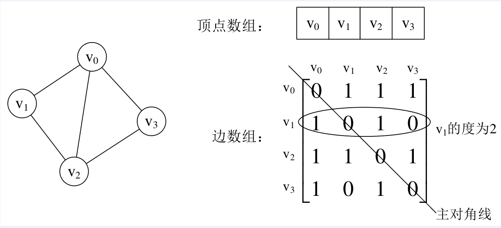
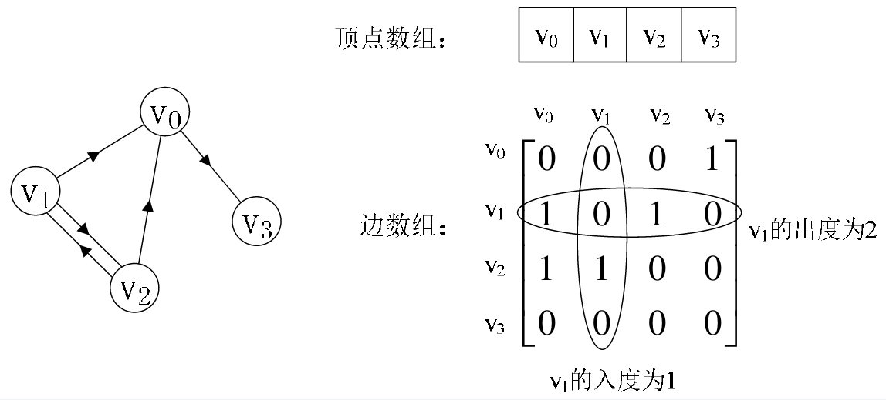
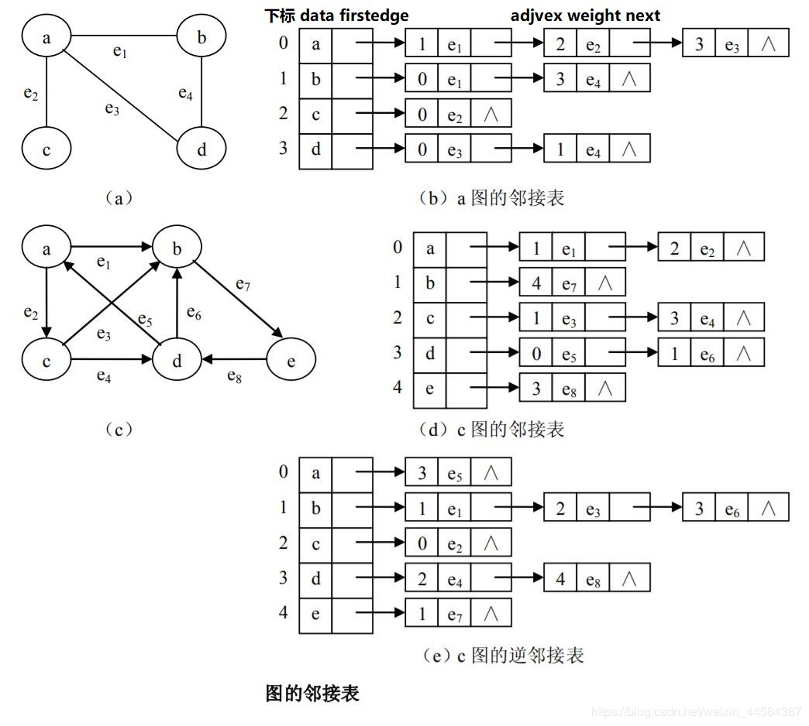

## 图(Graph)

### 基本概念

图是一种很灵活的数据结构，数据存储是非线性的，也就是每个数据之间都可以定义一种连接关系，不像链表，树结构那样需要线性连接关系。图中的对象同其他结构相似，可以是具体的数据，也可以是非具体的，比如业务或状态。

图由顶点和边两种类型的元素组成，顶点代表对象，边则是建立起对象之间的关联。图可分为有向图和无向图，还有混合图，当然无向图和混合图可以使用有向图表示。

图中的两个重要关系：邻接(adjacency)和关联(incidence)。 邻接是两个顶点之间的一种关系，如果图包含边(u,v)，则称顶点v和顶点u邻接。 关联是指顶点和边之间的关系，在有向图中，边（u，v）从顶点u开始关联到顶点v，或者相反，从顶点v开始关联到顶点u。

联通性：连通性是图中的一个重要概念。对于无向图而言，如果它的每个顶点都能通过某条路径到达其他顶点，那么我们称它为连通的。如果该条件在有向图中同样成立，则称该图是强连通的。

### 图的存储

图的存储结构除了要存储图中的各个顶点本身的信息之外，还要存储顶点与顶点之间的关系，邻接矩阵和邻接表是图常用的的存储结构。

**邻接矩阵**

邻接矩阵通常使用两个数组来表示图，用一个一位数组存储图中的顶点信息，用一个二维数组（邻接矩阵）存储图中的边的关系。

无向图邻接矩阵：

有向图邻接矩阵：

邻接矩阵的不足：由于存在n个顶点的图需要n*n个数组元素进行存储，当图为稀疏图时，使用邻接矩阵存储方法将会出现大量0元素，这会造成极大的空间浪费。这时，可以考虑使用邻接表表示法来存储图中的数据。

**邻接表**

邻接表由表头节点和表节点两部分组成，图中每个顶点均对应一个存储在数组中的表头节点。如果这个表头节点所对应的顶点存在邻接节点，则把邻接节点依次存放于表头节点所指向的单向链表中。

