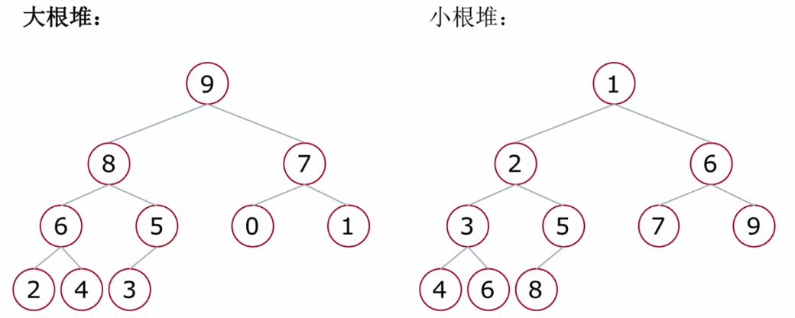
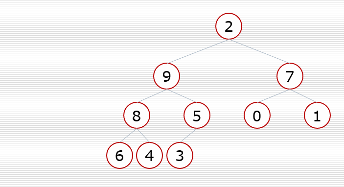
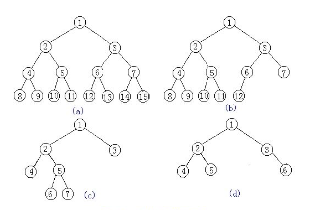

## 堆(Heap)

堆是一种特殊的完全二叉树结构。

大根堆：一棵完全二叉树，满足任一节点都比其孩子节点大；

小根堆：一棵完全二叉树，满足任一节点都比其他孩子节点小。

堆向下调整：当根节点的左右子树都是堆时（根节点不满足堆的性质），可以通过一次向下的调整来将其变换成一个堆。

**补充说明**：

满二叉树：一个二叉树，如果每一层的节点数都达到最大值，则这个二叉树就是满二叉树。如下图(a) 就是满二叉树。

完全二叉树：叶节点只能出现在最下层和次下层，并且最下面一层的结点都集中在该层最左边的若干位置的二叉树，如下图(b)。（也就是说，相对比满二叉树而言，他可以缺少子节点，但是只能从最后按顺序缺）

