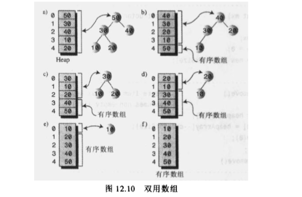

## 堆排序

堆排序是基于数组，使用二叉树构造堆进行的排序，是一种高效的排序，时间复杂度为O(NlogN)。比快速排序略慢，但它对初始数据的分布并不敏感，有时候快速排序的时间复杂度可能会降到O(N^2)，而堆排序对任意数据排序的复杂度都是O(NlogN)。

堆排序过程

1. 建堆
2. 得到堆顶元素为最大元素
3. 将堆顶元素从堆中移除，将堆最后一个元素放到堆顶，此时可通过调整重新使堆有序。
4. 重复步骤3，直到堆变为空

为了节省空间，堆和初始数组可以使用同一数组，具体操作就是将每次由堆顶移除的数据项放在数组末端，此时只需用一个变量来记录数组的大小，忽略已经排好序的数据项就行。



实例代码：

```java
package algorithm;

import static java.lang.Math.random;

public class HeapSort {

    public static void main(String[] args) {

        int size = 16; // the number of items

        Heap theHeap = new Heap(size);

        for (int i = 0; i < size; i++) {
            int rand = (int)(random() * 100);
            Node newNode = new Node(rand);

            theHeap.insertAt(i, newNode);
            theHeap.incrementSize();
        }

        System.out.print("Random:");
        theHeap.dispayArray();

        for (int j = size/2; j >= 0; j--){
            theHeap.trickleDown(j);     // 将数组转换为堆
        }

        System.out.println("Heap:");
        theHeap.dispayArray();
        theHeap.displayHeap();


        for (int k = size - 1; k > 0; k--) {

            // 从堆中移除数据项并写回数组末端
            Node biggestNode = theHeap.remove();
            theHeap.insertAt(k, biggestNode);
            
        }

        System.out.print("Sorted: ");
        theHeap.dispayArray();
    }

}


class Node{

    private int iData;

    public Node(int key){
        iData = key;
    }

    public int getKey(){
        return iData;
    }
}


class Heap{

    private Node[] heapArray;
    private int maxSize;
    private int currentSize;


    public Heap(int size){
        maxSize = size;
        heapArray = new Node[maxSize];
        currentSize = 0;
    }

    public Node remove(){
        Node root = heapArray[0];

        heapArray[0] = heapArray[--currentSize];
        trickleDown(0); //向下调整成堆

        return root;
    }

    public void trickleDown(int index) {

        int largeChild;
        Node top  = heapArray[index]; // 保存父亲节点

        while (index < currentSize/2){
            int leftChild = 2 * index + 1;
            int rightChild = leftChild + 1;

            // 判断右孩子是否存在，且找出关键值大的孩子
            if(rightChild < currentSize && heapArray[leftChild].getKey()
                    < heapArray[rightChild].getKey()){

                largeChild = rightChild;
            }
            else
                largeChild =leftChild;

            // 父亲节点的关键字是否大于最大孩子
            if(top.getKey() >= heapArray[largeChild].getKey()){
                break;
            }

            heapArray[index] = heapArray[largeChild]; // 交换调整
            index = largeChild; // 继续往下
        }

        heapArray[index] = top; // root-->index
    }


    public void displayHeap(){
        int nBlank = 32;
        int itemsPerRom = 1;

        int colunm = 0;
        int j = 0;

        System.out.println("......................................");

        while(currentSize > 0){

            if(colunm == 0){
                for (int i = 0; i < nBlank ; i++) {
                    System.out.print(' ');
                }
            }

            System.out.print(heapArray[j].getKey());

            if (++j == currentSize)
                break;

            if(++colunm == itemsPerRom){ // 行结束了吗？
                nBlank /= 2;
                itemsPerRom *= 2;
                colunm = 0;
                System.out.println(); // 换行
            }
            else{
                for (int i = 0; i < nBlank*2-2; i++) {
                    System.out.print(' ');
                    
                }
            }
        }

        System.out.println("\n......................................");
    }

    public void dispayArray(){
        for (int i = 0; i < maxSize; i++) {
            System.out.print(heapArray[i].getKey() + " ");
        }
        System.out.println();
    }

    public void insertAt(int index, Node newNode){
        heapArray[index] = newNode;
    }

    public void incrementSize(){
        currentSize++;
    }
}
```

