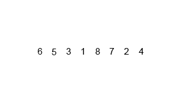

## 归并排序

归并排序利用了分治的思想，也使用了递归的方法，递归算法在后面还有更详细的介绍，这里主要是讨论排序算法，归并排序主要是通过将一个序列拆分为若干个子序列，将子序列进行调整为有序，然后将有序子序列合并为整体有序列。

归并排序动图演示如下：



归并排序需要O(n*logN) 的时间，而且需要一个大小和原数组大小相等的数组空间作为辅助数组。实例代码需要理解的merge方法是如何执行的，这是整个算法的关键和难点。

```java
package algorithm;

import static java.lang.Math.random;

public class MergeSort {

    public static void main(String[] args) {

        int maxSize = 16;
        MergeSortArr arr = new MergeSortArr(maxSize);

        for(int i = 0; i < maxSize; i++){
            int value = (int)(random() * 99);
            arr.insert(value);
        }

        arr.display();

        arr.mergeSort();

        arr.display();
    }
}


class MergeSortArr{

    private int theArray[];
    private int nElems;

    public MergeSortArr(int size){
        theArray = new int[size];
        nElems = 0;
    }

    public void insert(int value){
        theArray[nElems] = value;
        nElems++;
    }

    public void display(){

        System.out.print("theArray: ");
        for (int i = 0; i < nElems; i++) {
            System.out.print(theArray[i] + " ");
        }
        System.out.println();
    }

    public void mergeSort(){
        int arr[] = new int[nElems];  // 辅助数组
        recMergeSort(arr, 0 , nElems-1);
    }


    public void recMergeSort(int arr[], int start, int end){
        if(start < end){
            int mid = (start + end)/2;

            recMergeSort(arr, start, mid); // 前半部分
            recMergeSort(arr, mid+1, end); // 后半部分

            merge(arr, start, mid, end);  // 合并
        }
    }


    private void merge(int[] temp, int left, int mid, int right) {

        int tempPtr = left; // 存放

        int leftPtr = left; // 检测
        int midPtr = mid + 1;

        while (leftPtr <= mid && midPtr <= right){
            if(theArray[leftPtr] <= theArray[midPtr]){
                temp[tempPtr++] = theArray[leftPtr++];
            }
            else
                temp[tempPtr++] = theArray[midPtr++];
        }

        while(leftPtr <= mid){
            temp[tempPtr++] = theArray[leftPtr++];
        }

        while (midPtr <= right){
            temp[tempPtr++] = theArray[midPtr++];
        }

        // 存回
        for (int i = left; i <= right ; i++) {
            theArray[i] = temp[i];
        }
    }
}

```

