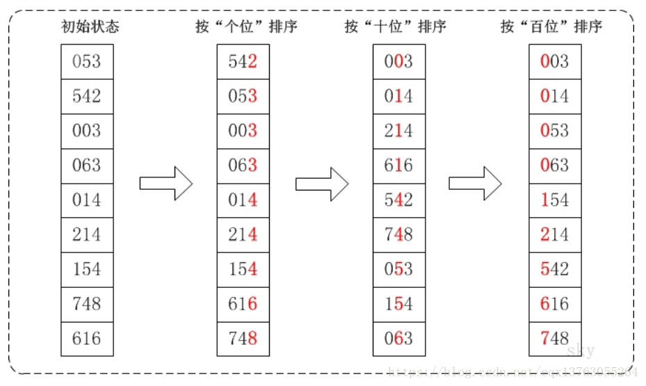

## 基数排序

基数排序和之前的排序有所不同，它是利用桶结构进行数据采集分派，最终成为有序序列，并不是进行数据比较移动。因为每个桶内的元素个数是未知的，所以需要借助链表结构来实施分配时向桶内仍记录的过程，所以在实例代码中使用了java内部工具类`ArrayList`。

基数排序有两种排序思想分别是MSD(最高位优先)和LSD(最低位优先)，大体思路都差不多，但LSD实现起来要相对直观和容易些，也是比较常用的。

基数排序的时间复杂度和快排相同，但是使用的存储空间是快排的两倍，而实际应用中基数排序也很少使用，了解一下即可。

下面是基数排序的一个示意图：




基数排序实例代码：

```java
package algorithm;

import java.util.ArrayList;
import java.util.Arrays;

public class RedixSort {


    public static void main(String[] args) {

        int[] arr = new int[] { 16, 13, 21, 4, 7, 11, 35, 66};
        System.out.println("未排序的数组：" + Arrays.toString(arr));

        redixSort(arr);

        System.out.println("排序后的数组：" + Arrays.toString(arr));
    }


    public static void redixSort(int arr[]){

        int max = arr[0];  // 算出最大数的位数
        for (int i = 0; i < arr.length; i++) {
            max = Math.max(max, arr[i]);
        }

        int maxDigit = 0;
        while(max != 0){
            max /= 10;
            maxDigit++;
        }

        // 桶表（链表+数组）
        ArrayList<ArrayList<Integer>> bucketList = new
                ArrayList<ArrayList<Integer>>();

        // 10个链表
        for (int i = 0; i < 10; i++)
            bucketList.add(new ArrayList<Integer>());

        int mod = 10;
        int div = 1;

        for (int i = 0; i < maxDigit; i++) {

            // LSD 由地位到高位
            for (int j = 0; j < arr.length; j++) {
                int num = (arr[j] % mod) / div;  // 取出对应位
                bucketList.get(num).add(arr[j]);
            }
            
            int index = 0;
            for (int j = 0; j < bucketList.size() ; j++) {
                for (int k = 0; k < bucketList.get(j).size(); k++)
                    arr[index++] = bucketList.get(j).get(k); // 从桶表中取值

                bucketList.get(j).clear();
            }

            mod = mod * 10;  // 为了取位改变因子
            div = div * 10;
        }
    }
}

```

