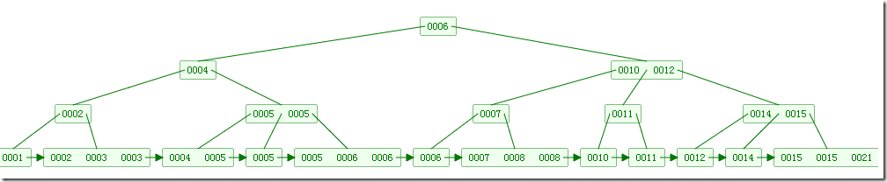

### 2-3-4树

2-3-4树是一棵自平衡的多路查找树，它的任一节点只能是1个或2个或3个key，对应的子节点为2个子节点或3个子节点或4个子节点，所有叶子节点到根节点的长度一致。

并且每个节点的key从左到右保持了从小到大的顺序，两个key之间的子树中所有的key一定大于它的父节点的左key，小于父节点的右key，对于3个key的节点，两两key之间也是如此。

分析2-3-4树我们可以和红黑树作比较分析。红-黑树的层数（平衡二叉树）大约是log2(N+1)，而2-3-4树每个节点可以最多有4个数据项，如果节点都是满的，那么高度和log4N。但实际情况结点不可能是满的，所以2-3-4树的高度为log2N,2-3-4树很浪费空间，因为很多情况结点还不满一般，即使高度比红黑树小，但效率仍比红黑树稍差一些。

### B树

B树为了存储设备或者磁盘而设计的一种平衡查找树，B树的节点可以有很多个子节点，从几个到几万个不等。一棵m阶的B树定义为：

* 树中的每个结点最多含有m个孩子；
* 除了根结点和叶子结点，其他结点至少有[ceil(m / 2)（代表是取上限的函数）]个孩子；
* 若根结点不是叶子结点时，则至少有两个孩子（除了没有孩子的根结点）
* 所有的叶子结点都出现在同一层中，叶子结点不包含任何关键字信息；

下图是一个M=4 阶的B树:

### B+树

B+树可以说是B树的一种变形，它把数据都存储在叶结点，而内部结点只存关键字和孩子指针，因此简化了内部结点的分支因子。

B+树遍历也更高效，其中B+树只需所有叶子节点串成链表这样就可以从头到尾遍历，其中内部结点是并不存储信息，而是存储叶子结点的最小值作为索引。B+树用于数据库和文件系统中，NTFS等都使用B+树作为数据索引.

如下图，是一个B+树:

B和B+树的区别在于，B+树的非叶子结点只包含导航信息，不包含实际的值，所有的叶子结点和相连的节点使用链表相连，便于区间查找和遍历。

B+ 树的优点在于：

- 由于B+树在内部节点上不包含数据信息，因此在内存页中能够存放更多的key。 数据存放的更加紧密，具有更好的空间局部性。因此访问叶子节点上关联的数据也具有更好的缓存命中率。
- B+树的叶子结点都是相链的，因此对整棵树的便利只需要一次线性遍历叶子结点即可。而且由于数据顺序排列并且相连，所以便于区间查找和搜索。而B树则需要进行每一层的递归遍历。相邻的元素可能在内存中不相邻，所以缓存命中性没有B+树好。

B树也有优点，其优点在于，由于B树的每一个节点都包含key和value，因此经常访问的元素可能离根节点更近，因此访问也更迅速。